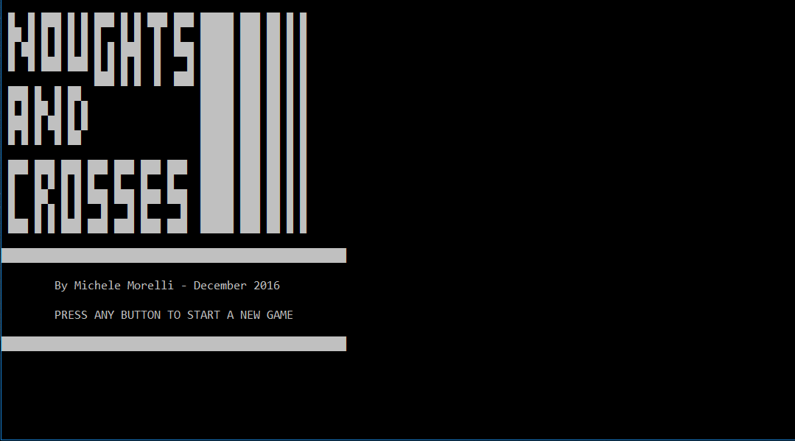
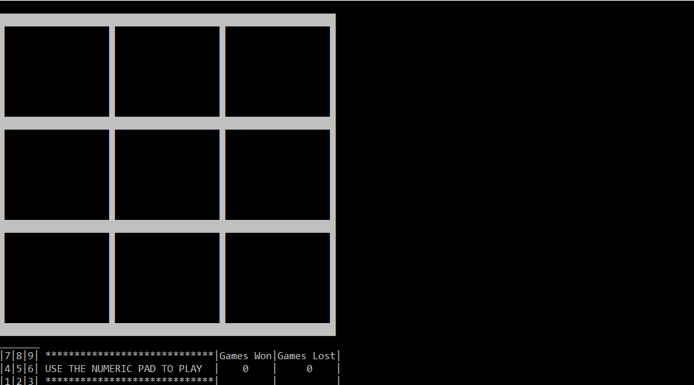

# Tic_Tac_toe_with_bitmapped_graphics (Windows only)

Tic Tac Toe game in C for the Windows console, featuring:

- Simple , partially randomised AI;
- Bitmapped graphic interface for the console.

I made this project for the final the assignment of a C university course I took in late 2016. It only runs in Windows due to the fact that it uses windows.h and other Windows-specific commands.

The binary code for the drawline() function was made with a small program I wrote in VBA for MS Excel. It allows to draw with an easy-to-use graphical interface, and then export the binary strings into the source code.


# How to compile
This source code can be compiled in Windows - I tested it on Visual Studio, where it is compiled quite easily. Unfortunately it does GCC complains a bit about some things (e.g. getch()).
I find that the easiest way to compile it is to open Visual Studio's Developer Command Prompt by using something like:
```
c:/your/directory/ cl Noughts_and_crosses_final.c
```

Enjoy! :-)
MM
